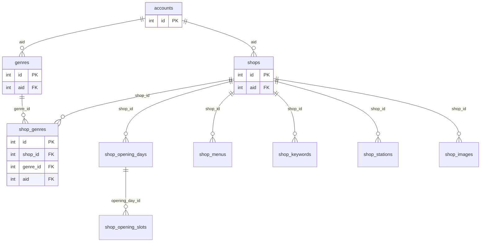

# お店管理 DB 仕様書（shops スキーマ）

## 1. 概要

| 項目 | 内容 |
|------|------|
| DBMS | PostgreSQL |
| スキーマ | `shops` |
| 用途 | ユーザーごとのお店情報（営業時間・メニュー・最寄り駅・参考画像など）の管理 |
| 削除方針 | **論理削除**（`is_deleted = true` の行は通常の参照・検索対象外） |
| データ格納方針 | 参考画像を含め、本仕様のデータはすべて DB テーブルに格納する |

### 1.1 既存テーブルとの関係

ユーザー（アカウント）は既存の `public.accounts` で管理する。

| 項目 | 内容 |
|------|------|
| 参照先テーブル | `public.accounts` |
| 参照先カラム | `id` |
| 本スキーマでのカラム名 | **`aid`**（account id の略） |
| 意味 | 行の所有者となるアカウント。ログイン中ユーザーの `accounts.id` と一致するデータのみ操作対象とする |

**アプリ側の前提**

- JWT の `sub`（ユーザー ID）から `accounts.id` を取得し、各 API では **`aid = 自分の accounts.id`** かつ **`is_deleted = false`** の行のみ読み書きする
- `public.accounts` 側で `is_deleted = true` のアカウントは、本スキーマのデータ操作対象外とする

---

## 2. ER 概要

---

## 3. 共通ルール

### 3.1 型・命名

| ルール | 内容 |
|--------|------|
| 主キー | `integer` + シーケンス（`GENERATED BY DEFAULT AS IDENTITY` または `SERIAL` 相当） |
| タイムスタンプ | `timestamp without time zone`、既定値 `now()` |
| 日付 | `date` |
| 時刻 | `time without time zone` |
| 論理削除 | `is_deleted boolean NOT NULL DEFAULT false` |
| 監査カラム | `created_at`, `updated_at`（更新時はアプリまたは DB トリガーで `updated_at` を更新） |

### 3.2 曜日（`day_of_week`）

全テーブルで共通の意味とする。

| 値 | 曜日 |
|----|------|
| 0 | 日曜 |
| 1 | 月曜 |
| 2 | 火曜 |
| 3 | 水曜 |
| 4 | 木曜 |
| 5 | 金曜 |
| 6 | 土曜 |

- CHECK 制約: `day_of_week BETWEEN 0 AND 6`

### 3.3 論理削除

| 対象 | 扱い |
|------|------|
| すべてのテーブル | `is_deleted = false` の行のみ一覧・詳細・検索の対象 |
| 店舗削除時 | `shops.is_deleted = true` とし、子テーブルは行を残す（子も個別に論理削除するかは API 実装で統一） |
| 一意制約 | 論理削除済み行と名前の重複を許容するため、**部分一意インデックス**（`WHERE is_deleted = false`）を用いる |

### 3.4 `aid` の整合性

子テーブルにも `aid` を持たせ、ユーザー単位の絞り込みを容易にする。

- **DB 制約**: 子テーブルの `aid` は、参照先 `shops.aid` と一致している必要がある
- **実装方針**: 複合外部キー `(shop_id, aid) REFERENCES shops.shops (id, aid)` で DB レベル保証（`shops` に `(id, aid)` の UNIQUE 制約が必要）

### 3.5 営業時間の補足

- 1 曜日あたり **複数の営業時間帯**（ランチ・ディナー、休憩前後など）を `shop_opening_slots` で表現する
- **曜日ごとの補足メモ**（例:「第 2・第 4 水曜定休」）は `shop_opening_days.day_memo` に格納する
- **曜日に依存しないメモ**（例:「祝日は休み」）は `shops.schedule_memo` に格納する
- 日をまたぐ営業（例 18:00〜翌 2:00）は、`close_time < open_time` を「翌日終了」と解釈する（アプリ側ルール）
- **定休日**は、その曜日にスロットを登録せず、`day_memo` や `schedule_memo` で記述する（休業専用フラグは設けない）

### 3.6 ジャンルと店舗の関係

- ジャンルは `shops.genres` でユーザーごとに自由追加する
- 1 店舗に **複数ジャンル** を付与できる（多対多）。関連は `shops.shop_genres` で管理する
- 同一店舗への同一ジャンルの重複付与は不可

### 3.7 参考画像

- 画像バイナリは `bytea` カラム `image_data` に格納する
- `mime_type`（例: `image/jpeg`）と `file_name`（元ファイル名・表示用）を併せて保持する
- **1 枚あたりの上限サイズは 5MB**（5,242,880 バイト）。超過分はアプリ側で拒否する

---

## 4. テーブル定義

### 4.1 `shops.genres`（ジャンル）

ユーザーが自由に追加・編集するジャンルマスタ。店舗には `shop_genres` 経由で複数付与可能。

| カラム | 型 | NULL | 既定値 | 説明 |
|--------|-----|------|--------|------|
| `id` | integer | NOT NULL | シーケンス | 主キー |
| `aid` | integer | NOT NULL | — | アカウント ID。`public.accounts.id` を参照 |
| `name` | varchar(100) | NOT NULL | — | ジャンル名（例: ラーメン、カフェ） |
| `sort_order` | integer | NOT NULL | 0 | 表示順（小さいほど先） |
| `is_deleted` | boolean | NOT NULL | false | 論理削除フラグ |
| `created_at` | timestamp | NOT NULL | now() | 作成日時 |
| `updated_at` | timestamp | NOT NULL | now() | 更新日時 |

**主キー・外部キー**

| 種別 | 名称（案） | 定義 |
|------|------------|------|
| PRIMARY KEY | `genres_pkey` | `(id)` |
| FOREIGN KEY | `genres_aid_fkey` | `aid` → `public.accounts(id)` ON DELETE RESTRICT |
| UNIQUE | `genres_id_aid_key` | `(id, aid)` ※`shop_genres` の複合 FK 用 |

**インデックス・制約**

| 種別 | 名称（案） | 定義 |
|------|------------|------|
| UNIQUE（部分） | `uq_genres_aid_name_active` | `(aid, name)` WHERE `is_deleted = false` |
| INDEX | `ix_genres_aid` | `(aid)` |

---

### 4.2 `shops.shops`（店舗）

店舗の基本情報。

| カラム | 型 | NULL | 既定値 | 説明 |
|--------|-----|------|--------|------|
| `id` | integer | NOT NULL | シーケンス | 主キー |
| `aid` | integer | NOT NULL | — | アカウント ID。`public.accounts.id` を参照 |
| `name` | varchar(200) | NOT NULL | — | 店名 |
| `address` | text | NULL | — | 住所（Google マップ表示用） |
| `schedule_memo` | text | NULL | — | 曜日に限らない営業メモ（祝日休みなど） |
| `last_verified_on` | date | NULL | — | 最終確認日 |
| `memo` | text | NULL | — | 汎用メモ |
| `is_deleted` | boolean | NOT NULL | false | 論理削除フラグ |
| `created_at` | timestamp | NOT NULL | now() | 作成日時 |
| `updated_at` | timestamp | NOT NULL | now() | 更新日時 |

**主キー・外部キー**

| 種別 | 名称（案） | 定義 |
|------|------------|------|
| PRIMARY KEY | `shops_pkey` | `(id)` |
| FOREIGN KEY | `shops_aid_fkey` | `aid` → `public.accounts(id)` ON DELETE RESTRICT |
| UNIQUE | `shops_id_aid_key` | `(id, aid)` ※子テーブルの複合 FK 用 |

**インデックス・制約**

| 種別 | 名称（案） | 定義 |
|------|------------|------|
| INDEX | `ix_shops_aid` | `(aid)` |
| INDEX | `ix_shops_aid_name_active` | `(aid, name)` WHERE `is_deleted = false` |

---

### 4.3 `shops.shop_genres`（店舗とジャンルの関連）

店舗に付与するジャンル（多対多の中間テーブル）。

| カラム | 型 | NULL | 既定値 | 説明 |
|--------|-----|------|--------|------|
| `id` | integer | NOT NULL | シーケンス | 主キー |
| `shop_id` | integer | NOT NULL | — | 店舗 ID |
| `genre_id` | integer | NOT NULL | — | ジャンル ID |
| `aid` | integer | NOT NULL | — | アカウント ID（`shops.aid`・`genres.aid` と一致） |
| `sort_order` | integer | NOT NULL | 0 | 店舗内でのジャンル表示順 |
| `is_deleted` | boolean | NOT NULL | false | 論理削除フラグ |
| `created_at` | timestamp | NOT NULL | now() | 作成日時 |
| `updated_at` | timestamp | NOT NULL | now() | 更新日時 |

**主キー・外部キー**

| 種別 | 名称（案） | 定義 |
|------|------------|------|
| PRIMARY KEY | `shop_genres_pkey` | `(id)` |
| FOREIGN KEY | `shop_genres_shop_aid_fkey` | `(shop_id, aid)` → `shops.shops(id, aid)` ON DELETE RESTRICT |
| FOREIGN KEY | `shop_genres_genre_aid_fkey` | `(genre_id, aid)` → `shops.genres(id, aid)` ON DELETE RESTRICT |
| FOREIGN KEY | `shop_genres_aid_fkey` | `aid` → `public.accounts(id)` ON DELETE RESTRICT |

**インデックス・制約**

| 種別 | 名称（案） | 定義 |
|------|------------|------|
| UNIQUE（部分） | `uq_shop_genres_shop_genre_active` | `(shop_id, genre_id)` WHERE `is_deleted = false` |
| INDEX | `ix_shop_genres_shop_id` | `(shop_id)` WHERE `is_deleted = false` |
| INDEX | `ix_shop_genres_genre_id` | `(genre_id)` WHERE `is_deleted = false` |

**補足**

- ジャンル未設定の店舗は、本テーブルに行がない状態で表現する
- 削除済みジャンルが紐づく行は、`genres.is_deleted = true` を JOIN して「（削除済み）」等と表示する

---

### 4.4 `shops.shop_opening_days`（曜日別営業設定）

店舗 × 曜日ごとの設定。補足メモと時間帯スロットの親。

| カラム | 型 | NULL | 既定値 | 説明 |
|--------|-----|------|--------|------|
| `id` | integer | NOT NULL | シーケンス | 主キー |
| `shop_id` | integer | NOT NULL | — | 店舗 ID |
| `aid` | integer | NOT NULL | — | アカウント ID（`shops.aid` と一致） |
| `day_of_week` | smallint | NOT NULL | — | 曜日（0=日 … 6=土） |
| `day_memo` | text | NULL | — | その曜日の補足メモ |
| `is_deleted` | boolean | NOT NULL | false | 論理削除フラグ |
| `created_at` | timestamp | NOT NULL | now() | 作成日時 |
| `updated_at` | timestamp | NOT NULL | now() | 更新日時 |

**主キー・外部キー**

| 種別 | 名称（案） | 定義 |
|------|------------|------|
| PRIMARY KEY | `shop_opening_days_pkey` | `(id)` |
| FOREIGN KEY | `shop_opening_days_shop_aid_fkey` | `(shop_id, aid)` → `shops.shops(id, aid)` ON DELETE RESTRICT |
| FOREIGN KEY | `shop_opening_days_aid_fkey` | `aid` → `public.accounts(id)` ON DELETE RESTRICT |

**インデックス・制約**

| 種別 | 名称（案） | 定義 |
|------|------------|------|
| CHECK | `shop_opening_days_day_of_week_check` | `day_of_week BETWEEN 0 AND 6` |
| UNIQUE（部分） | `uq_shop_opening_days_shop_dow_active` | `(shop_id, day_of_week)` WHERE `is_deleted = false` |
| INDEX | `ix_shop_opening_days_shop_id` | `(shop_id)` |

---

### 4.5 `shops.shop_opening_slots`（営業時間帯）

1 曜日内の複数時間帯（休憩で分かれる枠など）。

| カラム | 型 | NULL | 既定値 | 説明 |
|--------|-----|------|--------|------|
| `id` | integer | NOT NULL | シーケンス | 主キー |
| `opening_day_id` | integer | NOT NULL | — | 曜日別設定 ID |
| `shop_id` | integer | NOT NULL | — | 店舗 ID（検索・整合性用） |
| `aid` | integer | NOT NULL | — | アカウント ID |
| `open_time` | time | NOT NULL | — | 開店時刻 |
| `close_time` | time | NOT NULL | — | 閉店時刻 |
| `sort_order` | integer | NOT NULL | 0 | 同一曜日内の表示順 |
| `is_deleted` | boolean | NOT NULL | false | 論理削除フラグ |
| `created_at` | timestamp | NOT NULL | now() | 作成日時 |
| `updated_at` | timestamp | NOT NULL | now() | 更新日時 |

**主キー・外部キー**

| 種別 | 名称（案） | 定義 |
|------|------------|------|
| PRIMARY KEY | `shop_opening_slots_pkey` | `(id)` |
| FOREIGN KEY | `shop_opening_slots_opening_day_fkey` | `opening_day_id` → `shops.shop_opening_days(id)` ON DELETE RESTRICT |
| FOREIGN KEY | `shop_opening_slots_shop_aid_fkey` | `(shop_id, aid)` → `shops.shops(id, aid)` ON DELETE RESTRICT |
| FOREIGN KEY | `shop_opening_slots_aid_fkey` | `aid` → `public.accounts(id)` ON DELETE RESTRICT |

**インデックス・制約**

| 種別 | 名称（案） | 定義 |
|------|------------|------|
| INDEX | `ix_shop_opening_slots_opening_day_id` | `(opening_day_id)` WHERE `is_deleted = false` |
| INDEX | `ix_shop_opening_slots_shop_id` | `(shop_id)` |

**補足**

- `open_time = close_time` は不正（アプリでバリデーション）
- 店舗編集 API では、曜日単位でスロットをまとめて差し替える実装を推奨

---

### 4.6 `shops.shop_menus`（頼みたいメニュー）

| カラム | 型 | NULL | 既定値 | 説明 |
|--------|-----|------|--------|------|
| `id` | integer | NOT NULL | シーケンス | 主キー |
| `shop_id` | integer | NOT NULL | — | 店舗 ID |
| `aid` | integer | NOT NULL | — | アカウント ID |
| `menu_name` | varchar(200) | NOT NULL | — | メニュー名 |
| `memo` | text | NULL | — | 補足（辛さ、サイズなど） |
| `sort_order` | integer | NOT NULL | 0 | 表示順 |
| `is_deleted` | boolean | NOT NULL | false | 論理削除フラグ |
| `created_at` | timestamp | NOT NULL | now() | 作成日時 |
| `updated_at` | timestamp | NOT NULL | now() | 更新日時 |

**主キー・外部キー**

| 種別 | 名称（案） | 定義 |
|------|------------|------|
| PRIMARY KEY | `shop_menus_pkey` | `(id)` |
| FOREIGN KEY | `shop_menus_shop_aid_fkey` | `(shop_id, aid)` → `shops.shops(id, aid)` ON DELETE RESTRICT |
| FOREIGN KEY | `shop_menus_aid_fkey` | `aid` → `public.accounts(id)` ON DELETE RESTRICT |

**インデックス**

| 名称（案） | 定義 |
|------------|------|
| `ix_shop_menus_shop_id` | `(shop_id)` WHERE `is_deleted = false` |

---

### 4.7 `shops.shop_keywords`（キーワード）

検索・分類用タグ。店舗に複数付与可能。

| カラム | 型 | NULL | 既定値 | 説明 |
|--------|-----|------|--------|------|
| `id` | integer | NOT NULL | シーケンス | 主キー |
| `shop_id` | integer | NOT NULL | — | 店舗 ID |
| `aid` | integer | NOT NULL | — | アカウント ID |
| `keyword` | varchar(100) | NOT NULL | — | キーワード |
| `sort_order` | integer | NOT NULL | 0 | 表示順 |
| `is_deleted` | boolean | NOT NULL | false | 論理削除フラグ |
| `created_at` | timestamp | NOT NULL | now() | 作成日時 |
| `updated_at` | timestamp | NOT NULL | now() | 更新日時 |

**主キー・外部キー**

| 種別 | 名称（案） | 定義 |
|------|------------|------|
| PRIMARY KEY | `shop_keywords_pkey` | `(id)` |
| FOREIGN KEY | `shop_keywords_shop_aid_fkey` | `(shop_id, aid)` → `shops.shops(id, aid)` ON DELETE RESTRICT |
| FOREIGN KEY | `shop_keywords_aid_fkey` | `aid` → `public.accounts(id)` ON DELETE RESTRICT |

**インデックス・制約**

| 種別 | 名称（案） | 定義 |
|------|------------|------|
| UNIQUE（部分） | `uq_shop_keywords_shop_keyword_active` | `(shop_id, keyword)` WHERE `is_deleted = false` |
| INDEX | `ix_shop_keywords_aid_keyword_active` | `(aid, keyword)` WHERE `is_deleted = false` ※駅名・キーワード検索用 |

---

### 4.8 `shops.shop_stations`（最寄り駅）

| カラム | 型 | NULL | 既定値 | 説明 |
|--------|-----|------|--------|------|
| `id` | integer | NOT NULL | シーケンス | 主キー |
| `shop_id` | integer | NOT NULL | — | 店舗 ID |
| `aid` | integer | NOT NULL | — | アカウント ID |
| `transport_type` | varchar(50) | NOT NULL | — | 交通機関（例: 電車、地下鉄、バス、その他） |
| `line_name` | varchar(100) | NULL | — | 路線名（任意） |
| `station_name` | varchar(100) | NOT NULL | — | 駅名・停留所名 |
| `walk_minutes` | smallint | NULL | — | 徒歩分数 |
| `distance_memo` | text | NULL | — | 距離の補足（徒歩 5 分、バスで 10 分など） |
| `sort_order` | integer | NOT NULL | 0 | 表示順（主要駅を先に） |
| `is_deleted` | boolean | NOT NULL | false | 論理削除フラグ |
| `created_at` | timestamp | NOT NULL | now() | 作成日時 |
| `updated_at` | timestamp | NOT NULL | now() | 更新日時 |

**主キー・外部キー**

| 種別 | 名称（案） | 定義 |
|------|------------|------|
| PRIMARY KEY | `shop_stations_pkey` | `(id)` |
| FOREIGN KEY | `shop_stations_shop_aid_fkey` | `(shop_id, aid)` → `shops.shops(id, aid)` ON DELETE RESTRICT |
| FOREIGN KEY | `shop_stations_aid_fkey` | `aid` → `public.accounts(id)` ON DELETE RESTRICT |

**インデックス**

| 名称（案） | 定義 |
|------------|------|
| `ix_shop_stations_shop_id` | `(shop_id)` WHERE `is_deleted = false` |
| `ix_shop_stations_aid_station_active` | `(aid, station_name)` WHERE `is_deleted = false` ※駅名の部分一致検索用 |

**補足**

- `transport_type` は将来 enum 化してもよいが、初版は `varchar` で自由入力＋アプリ側候補リスト

---

### 4.9 `shops.shop_images`（参考画像）

| カラム | 型 | NULL | 既定値 | 説明 |
|--------|-----|------|--------|------|
| `id` | integer | NOT NULL | シーケンス | 主キー |
| `shop_id` | integer | NOT NULL | — | 店舗 ID |
| `aid` | integer | NOT NULL | — | アカウント ID |
| `file_name` | varchar(255) | NULL | — | 元ファイル名 |
| `mime_type` | varchar(100) | NOT NULL | — | MIME タイプ |
| `image_data` | bytea | NOT NULL | — | 画像バイナリ |
| `file_size_bytes` | integer | NOT NULL | — | ファイルサイズ（バイト） |
| `sort_order` | integer | NOT NULL | 0 | 表示順 |
| `is_deleted` | boolean | NOT NULL | false | 論理削除フラグ |
| `created_at` | timestamp | NOT NULL | now() | 作成日時 |
| `updated_at` | timestamp | NOT NULL | now() | 更新日時 |

**主キー・外部キー**

| 種別 | 名称（案） | 定義 |
|------|------------|------|
| PRIMARY KEY | `shop_images_pkey` | `(id)` |
| FOREIGN KEY | `shop_images_shop_aid_fkey` | `(shop_id, aid)` → `shops.shops(id, aid)` ON DELETE RESTRICT |
| FOREIGN KEY | `shop_images_aid_fkey` | `aid` → `public.accounts(id)` ON DELETE RESTRICT |

**インデックス**

| 名称（案） | 定義 |
|------------|------|
| `ix_shop_images_shop_id` | `(shop_id)` WHERE `is_deleted = false` |

**補足**

- **1 枚あたり 5MB（5,242,880 バイト）を上限**とし、超過するアップロードはアプリ側で拒否する
- `file_size_bytes` はアップロード時に設定し、上限チェックに用いる

---

## 5. テーブル一覧

| # | スキーマ.テーブル名 | 役割 |
|---|---------------------|------|
| 1 | `shops.genres` | ユーザー別ジャンルマスタ |
| 2 | `shops.shops` | 店舗基本情報 |
| 3 | `shops.shop_genres` | 店舗とジャンルの関連（多対多） |
| 4 | `shops.shop_opening_days` | 曜日別営業設定・曜日メモ |
| 5 | `shops.shop_opening_slots` | 曜日別の複数営業時間帯 |
| 6 | `shops.shop_menus` | 頼みたいメニュー |
| 7 | `shops.shop_keywords` | キーワード |
| 8 | `shops.shop_stations` | 最寄り駅・交通 |
| 9 | `shops.shop_images` | 参考画像（バイナリ） |

**外部参照（本スキーマ外）**

| 参照元カラム | 参照先 |
|--------------|--------|
| 各テーブルの `aid` | `public.accounts(id)` |

---

## 6. 検索想定（API 設計向けメモ）

| 検索種別 | 主な対象テーブル・カラム | 方式 |
|----------|--------------------------|------|
| 駅名 | `shop_stations.station_name` | **部分一致**（例: `ILIKE '%検索語%'`） |
| 住所・場所 | `shops.address`, `shops.name` | 部分一致（API 設計時に詳細化） |
| キーワード | `shop_keywords.keyword` | 部分一致（API 設計時に詳細化） |
| ジャンル | `genres.name`（`shop_genres` 経由で JOIN） | 部分一致または完全一致（API 設計時に詳細化） |

いずれも **`aid` = ログインユーザー** かつ **`is_deleted = false`** で絞り込む。

---

## 7. SQL 作成時の実行順（参考）

1. `CREATE SCHEMA shops;`
2. `shops.genres`
3. `shops.shops`
4. `shops.shop_genres`
5. `shops.shop_opening_days`
6. `shops.shop_opening_slots`
7. `shops.shop_menus`
8. `shops.shop_keywords`
9. `shops.shop_stations`
10. `shops.shop_images`

---

## 8. 確定した設計方針

| # | 項目 | 方針 |
|---|------|------|
| 1 | 1 店舗のジャンル数 | **複数可**（`shop_genres` で多対多） |
| 2 | 画像の格納 | **`bytea` で DB 内に保存**。1 枚あたり上限 **5MB** |
| 3 | 営業「休み」の表現 | その曜日のスロットなし ＋ `day_memo` / `schedule_memo` で記述 |
| 4 | 駅検索 | `shop_stations.station_name` の **部分一致** |
| 5 | 交通機関の種別 | `varchar` 自由入力（アプリで選択肢を提示） |

---

## 9. 関連ファイル（予定）

| ファイル | 内容 |
|----------|------|
| `DB/1_db.sql` | 本仕様に基づく DDL（別タスクで作成） |
| `API_SHOPS_SPEC.md` | HTTP API 仕様（別タスクで作成） |
